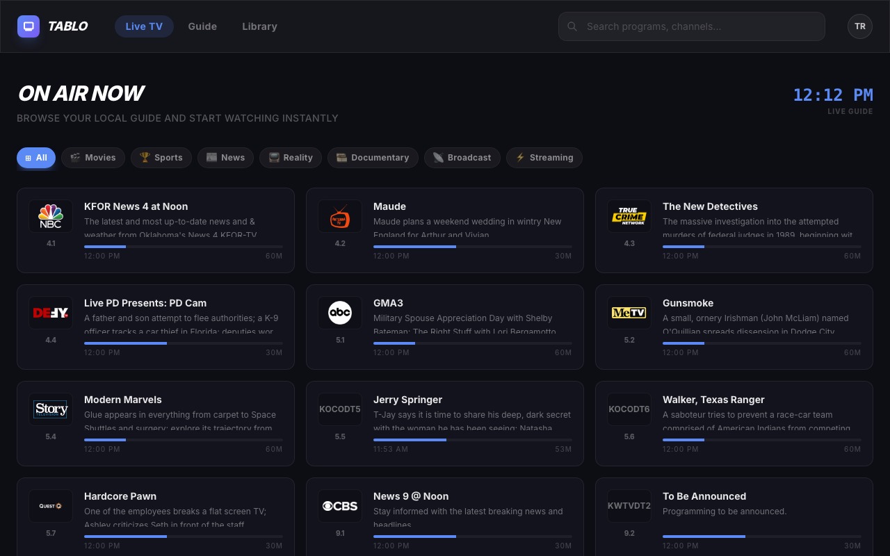
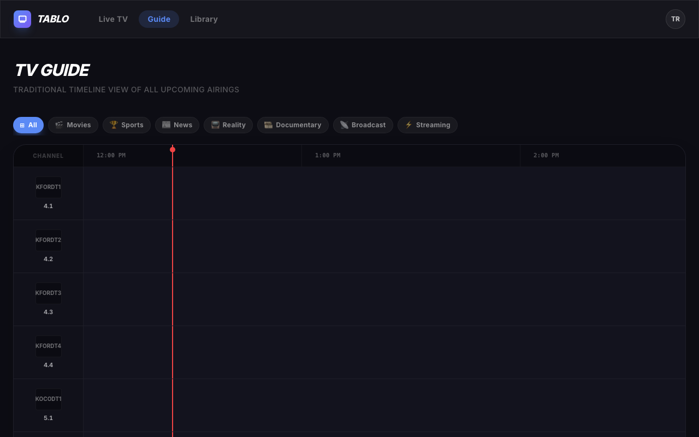
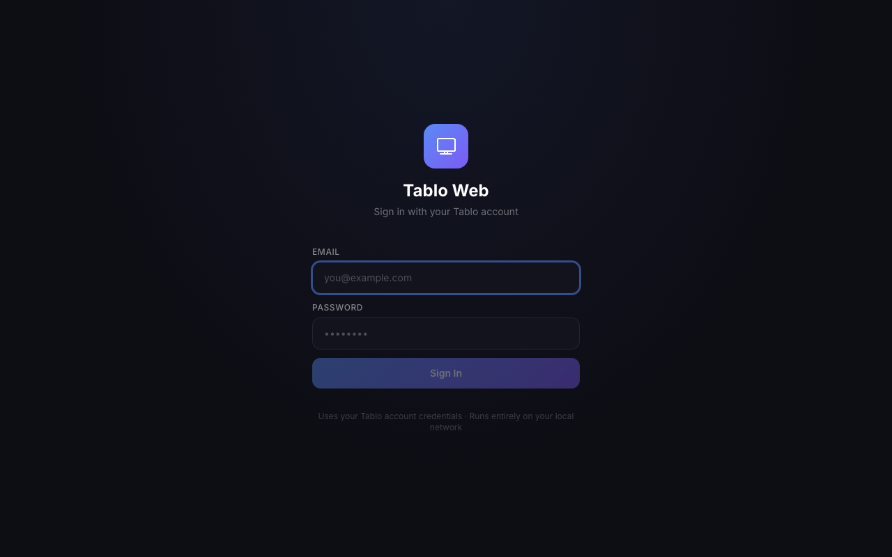
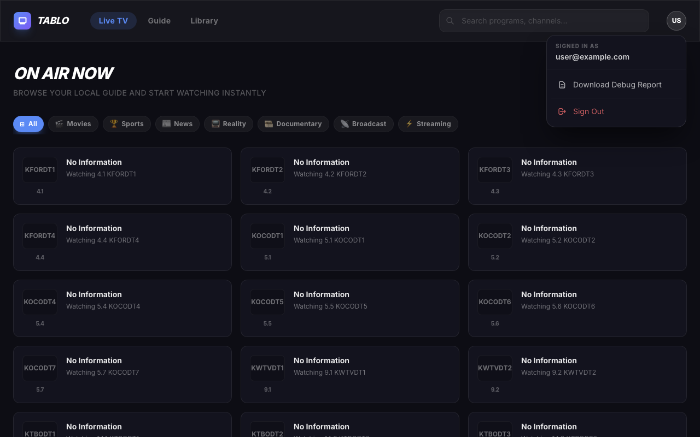

# tablo-web

[](https://github.com/trevor-viljoen/tablo-web/actions/workflows/ci.yml)
[](https://github.com/trevor-viljoen/tablo-web/releases)
[](https://github.com/trevor-viljoen/tablo-web)
[](https://github.com/trevor-viljoen/tablo-web)
[](https://github.com/trevor-viljoen/tablo-web)
[](https://opensource.org/licenses/MIT)

> **Warning**  
> This is an unofficial web interface for Tablo devices. It is not affiliated with Nuvyyo Inc. or Tablo. Use at your own risk.

A modern, responsive web application for your Tablo (Gen 4) devices. Built with React, TypeScript, FastAPI, and FFmpeg for seamless live TV streaming and library management.

---

## Screenshots

| Live TV | TV Guide |
|---|---|
|  |  |

| Login | Profile |
|---|---|
|  |  |

---

## Features

- **Live TV Streaming:** Smart transcoding (via FFmpeg) for high-compatibility browser playback.
- **Traditional Guide:** A full timeline/grid view of upcoming programs.
- **Library Management:** Browse and watch your recordings directly in the browser.
- **Auto-Discovery:** Automatically finds and connects to your Tablo devices on the local network.
- **Plex & Jellyfin Live TV:** HDHomeRun emulation — add tablo-web as a Live TV tuner in Plex or Jellyfin with full XMLTV EPG.
- **Containerized:** Easy deployment using Docker or Podman, with pre-built images on GHCR.

---

## Prerequisites

- **Tablo Gen 4 Device** (with an active account).
- **Docker** or **Podman** with **Docker Compose / Podman Compose**.
- **FFmpeg** (included in the backend container).

---

## Quick Start

### Option A — Pre-built images (recommended)

1. **Clone the repository:**
   ```bash
   git clone https://github.com/trevor-viljoen/tablo-web.git
   cd tablo-web
   ```

2. **Launch the stack:**
   ```bash
   # Using Docker
   docker-compose up -d

   # Using Podman
   podman-compose up -d
   ```

3. **Access the app:**
   Open `http://localhost:7070` in your browser.

4. **Login:**
   Use your Tablo account email and password to authenticate.

### Option B — Build from source

```bash
# Using Docker
docker-compose up -d --build

# Using Podman
podman-compose up -d --build
```

> **Local Dockerfile tweaks:** create a `docker-compose.override.yml` to test changes before committing — it is gitignored and automatically merged by Compose.

---

## Plex & Jellyfin Live TV

tablo-web exposes an HDHomeRun-compatible tuner interface so Plex and Jellyfin can use your Tablo as a Live TV source with a full multi-day EPG.

### Plex

1. Go to **Settings → Live TV & DVR → Set Up Plex DVR**.
2. Plex will auto-discover the tuner at `http://<host>:7070`. If not, enter it manually.
3. EPG data loads automatically — no Gracenote subscription needed.

### Jellyfin

1. Go to **Dashboard → Live TV → Add Tuner Device** → choose **M3U Tuner**.
   - URL: `http://<host>:7070/api/iptv/playlist.m3u`
2. Go to **Dashboard → Live TV → Add TV Guide Data Provider** → choose **XMLTV**.
   - URL: `http://<host>:7070/api/iptv/epg.xml`
3. Refresh guide data and browse **Live TV**.

> See [GitHub Issues](https://github.com/trevor-viljoen/tablo-web/issues) for known limitations with OTT channels and EPG matching.

---

## Architecture

- **Frontend:** React + Vite + Tailwind CSS + hls.js.
- **Backend:** FastAPI (Python) + FFmpeg for transcoding + [tablo-api](https://github.com/trevor-viljoen/tablo-api).
- **Proxy:** Nginx handles routing between the frontend and backend containers.

---

## Security

- This application proxies sensitive requests to your local Tablo device.
- Credentials (email/password) are stored locally in a `data/config.json` volume and are only used for authentication with the Tablo cloud API.
- Live streams are proxied and transcoded locally on your server.

---

## Reporting Bugs

If you encounter a bug, please follow these steps to help us diagnose the issue:

1. **Generate a debug report** — click the profile icon in the top-right corner of the app, then choose **Download Debug Report**. This creates a `tablo-debug-<timestamp>.json` file containing server diagnostics and browser info. It contains no passwords or personal information.

2. **Open an issue** on [GitHub Issues](https://github.com/trevor-viljoen/tablo-web/issues) and include:
   - A clear description of what happened and what you expected.
   - Steps to reproduce the issue.
   - Your browser and OS version.
   - The debug report JSON file attached to the issue.

3. **Browser console logs** — if the app shows an error, open your browser's developer tools (F12), go to the **Console** tab, and copy any red error messages into the issue.

---

## Support & Donations

If you find this project useful and would like to support its development, you can buy me a coffee!

[](https://paypal.me/trevorviljoen)
[](https://github.com/sponsors/trevor-viljoen)

---

## License

This project is licensed under the MIT License - see the [LICENSE](LICENSE) file for details.

> Tablo and the Tablo logo are trademarks of Nuvyyo Inc.
marks of Nuvyyo Inc.
